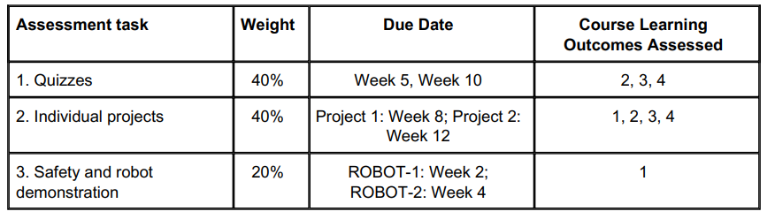

---
- [Outline](#outline)
- [Week1](#week1)
  - [TODO](#todo)
  - [Learning Contents](#learning-contents)
    - [Robot Introduction](#robot-introduction)
      - [DOF](#dof)
      - [Geometric Configuration](#geometric-configuration)
      - [Parallel Robot Arm](#parallel-robot-arm)
        - [Parallel Robot: The Steward Platform](#parallel-robot-the-steward-platform)
        - [Parallel Robot: The Delta Robot](#parallel-robot-the-delta-robot)
        - [Parallel vs Serial Robot](#parallel-vs-serial-robot)
      - [Types of robots](#types-of-robots)
      - [End Effectors 末端执行器](#end-effectors-末端执行器)
      - [Types of Grippers](#types-of-grippers)
      - [Types of tools](#types-of-tools)
      - [Work Envelope (work volumn/workspace)](#work-envelope-work-volumnworkspace)
      - [Motor Control System](#motor-control-system)
        - [Non-servo control](#non-servo-control)
        - [Servo control systems](#servo-control-systems)
      - [UR Robot e-Series Core Track](#ur-robot-e-series-core-track)
- [Week2 Sensors & Actuators](#week2-sensors--actuators)
  - [Actuators](#actuators)
    - [Electric](#electric)
    - [Hydraulic Actuator](#hydraulic-actuator)
    - [Pneumatic Actuator](#pneumatic-actuator)
    - [Micro and Nano Actuators](#micro-and-nano-actuators)
  - [Sensors](#sensors)
    - [Sensor types](#sensor-types)
    - [Robot Tactile Sensor](#robot-tactile-sensor)
  - [Modelling of 2-link robots](#modelling-of-2-link-robots)
    - [Forward Kinematic Equations](#forward-kinematic-equations)
    - [Inverse Kinematic Equation](#inverse-kinematic-equation)
    - [Velocity Kinenamatic](#velocity-kinenamatic)
  - [Real-Time Data Exchange (RTDE) in Matlab](#real-time-data-exchange-rtde-in-matlab)
  - [Robot Mudule](#robot-mudule)
    - [Feature Coordinates](#feature-coordinates)
    - [Force Control](#force-control)
    - [Force Control - point load](#force-control---point-load)
- [Week3 - Coordinate Frames & Homogeneous Transformations](#week3---coordinate-frames--homogeneous-transformations)
  - [Coordinate Frames](#coordinate-frames)
  - [Pose](#pose)
  - [Rotation Matrix](#rotation-matrix)
  - [Special Orthogonal Group](#special-orthogonal-group)
  - [Rotation about 3D axis](#rotation-about-3d-axis)
  - [Transform a vector in the same coordinate system](#transform-a-vector-in-the-same-coordinate-system)

---
# Outline
Assessment


1. Quizes: 2, WK5 (1-4), WK10 (1-9), 90 minutes

2. Individual Projects: project1 Kinematic Modelling and Trajectory Planning 20% (4,5 due WK8), project2 Path Planning 20% (8, due WK12)

3. Safety and robot demonstration: ROBOT1 (5%), ROBOT2 (15%)

# Week1
## TODO

- [x] Virtual Machine Installation (Downloaded the image)
- [x] RVC Installation 
- [x] RTDE Toolbox Installation (Matlab&Virtual machine have installed toolbox, need to be checked)
- [x] RMF Declared as Read
- [x] SWP (Safety work procedure) (Completed check, but not read, will be assessed)
- [x] UR5e 8 module training and donwload the certificate https://academy.universal-robots.com/free-e-learning/e-series-e-learning/e-series-core-track/
- [ ] Read through relevant Australian Standards accessible in Moodle (AS4024.3301/2/3)
- [ ] Go through Lab01 tasks
- [x] Ask tutor Raghav Hariharan, how to open the application damn.
  > Solved by using VMware instead

## Learning Contents
### Robot Introduction
Robot: A machine capable of carrying out a complex series of actions automatically, especially one programmable by a computer

#### DOF
DOF: degree of freedom, axis of movement

DOF calculation:
$$DOF = m(N-1-J) + \sum_{i=1}^Jf_i$$
> m = 6 for spatial, 3 for planner
> N: number of bodies including ground
> J: number of joints

Example: Four-bar
$$DOF = 3\times(4 - 1 - 4) + 4 = 1$$


To achieve any location and orientation in space, 6 DOF are needed: 3 for position, 3 for orientation


#### Geometric Configuration
Joint types:

Revolute折叠上下对折弯曲, Prismatic棱柱形前后伸缩, Spherical球型多角度旋转


Robot Arm Types:
1. Articulated Robots: closely resembles a human arm
-  A robot with **rotary joints** 旋转接头
-  Dexterous and versatile 灵巧多才多艺
-  Generally, 5-6 DOF

2. SCARA Robot (Selectively Compliant Assembly Robot Arm, RRP robot)
- 3-4 DOF
- This one is faster than Articulated Robots, high productivity
- Compliance: The extend to which a robot end-effector moves or deflects as a result of an applied force.
- Be restricted in one direction (that's why it is called "selectively")
- Cheap, high duty cycle


3. Cartesian Manipulators
- Simplest configuration
- Trivial inverse kinematic solution
- Typically slower and may take larger space


#### Parallel Robot Arm
Limitation in the serial link robot (open loop):
1. Deflection in any joint or link will change the location of all subsequent links.
2. The robot links and joints are made excessively strong to eliminate all deflections.
3. This will render the robot very heavy, massive, and slow

Parallel Robot Arm can solve this problem:
- A parallel arm have two or more independent kinematic chains connecting the base to the end-effector.
- Parallel Robot Arm changes the open loop to close loop
- Close-loop configurations provide greater structural rigidity, and hence greater accuracy


##### Parallel Robot: The Steward Platform
-  Consists of a Base and Platform (end-effector) and six independently actuated struts (prismatic joints)
- Spherical joints at both ends or a combination of spherical (ball joints) and universal joints (6DOF)
- All joints allow passive rotation (not actuated)


##### Parallel Robot: The Delta Robot
- Output link remains at fixed orientation with regard to input link
- By using three parallelograms (平行四边形) we completely restrain the orientation of the mobile platform
  - The movement of the platform is then characterised by three translational DOF
  - The input links are mounted on levers actuated through revolute joints or prismatic actuators


##### Parallel vs Serial Robot


#### Types of robots


#### End Effectors 末端执行器
- Device attached to robot wrist to perform a special task
- Commonly include grippers, assembly tools, and sensors

#### Types of Grippers
1. Mechanical/hooks
2. Suction/vacuum
3. Magnetic(ferrous material)
4. Scoops or ladles (fluids, powder, granulates) 勺子或勺子（液体、粉末、颗粒）

#### Types of tools
1. Spot welding gun 电焊
2. Arc welding tool 电弧焊
3. Spray painting gun
4. Drilling spindle
5. Surging tools

#### Work Envelope (work volumn/workspace)
- All positions in space the robot end effector can 
reach
- Depends on DOF and configuration
- The work envelope should encompass all the points that the robot arm is required to reach.However, it is wasteful to use a robot arm with a work envelope much bigger than necessary.
- It can be defined using Graphical, Numerical and Analytical method.


#### Motor Control System
##### Non-servo control
- Open-lop mode, no monitoring of the motion, the position or the velocity
- Movement is limited to predetermined mechanical stops (useful primarily for materials transfer)
- Suitable for repetitive tasks (easy to operate and maintain)

大致就是没有监测，不用改变，多用于重复性强的作业

##### Servo control systems
- Closed loop feedback control
- Difference between the control signal (set point) and real value (sensed) used to drive arm motions
- Control variables include position, speed and power
- Most robots are servo controlled

需要检测数据变化（位置，速度，动能等）进行控制改变，比如控制设定点和实际点的差异来改变运动


#### UR Robot e-Series Core Track
Robot Structure:
- 6 axes robot, 360 rotation is possible:
  1. base
  2. shoulder
  3. elbow
  4. wrist1
  5. wrist2
  6. wrist3

Control Box:
- Mother Board
- SD card
- safety control board
  1. handle all input and output from the control box
  2. handle connectivity to peripheral equipment
  3. The redundant safety input is for connection of external emergency stop and safeguard stop
  4. "Yellow": safety/general
  5. "Gray": digital input and output for general purposes (sensors, conveyors...)
  6. "Green": Analog signals
- Minal PC
- Teach pedant:
  1. Programming, operation, signal control

Teach Pedant Robot Operation:
1. Start the robot
   1. Red button on the bottum left
   2. Start button on the screen
2. Program the robot button
   1. it shows all the available program command in the left side
   2. Choose "move", and the "waypoint"
   3. Move the robot to set the "waypoint"
3. Move the robot by hand
   1. press and hold the black button on top of the teach pendant
   2. move the robot arm
4. Protective stop
   1. if the robot changes too quickly or find some resistance
   2. It will triger the "protective stop"
   3. Unlock the robot by removing all the external forces on the robot
   4. Click "Enable Robot" and "play" button
5. Put End Effector on the robot
  1. Put the end effector tool on
  2. Take out the cap of the tool connector on robot arm
  3. Connect the end effector to the tool connector
6. Rename the tool
   1. Get in the "Installation" menu on the top left
   2. Click "I/O setup" in the left side bar
   3. Select "tool out" in the "Output" column
   4. Rename the end effector
   5. Go to the "Tool I/O" in the left side bar
   6. Set the variables
   7. Go to the "IO" in the top left
   8. Operate the Gripper by clicking on the "Tool Digit Output"
7. Controll the external device using sensor (Ex: using sensor to let robot control the conveyor to pick up the box on the end of the conveyor)
   1. Put sensor on the conveyor
   2. Connect the conveyor to the control box (digital output: since the robot use the output signal to control the conveyor)
   3. Connect the sensor to the control box (digital input: since the robot receives the signal from the sensor)
   4. Rename the sensor and the conveyor in robot "Installation" as in "6. Rename the tool"
8. Control the robot arm to use the tool (Ex: Control the gripper to pick and place the box)
   1. Tool Centre Point (TCP)
      1. The centre between the points of the contact
      2. The robot needs to know the position of TCP relevant to the tool flange flame
      3. Click "Installation" on the top left
      4. Click the "TCP" button on the left side bar
      5. Measure the TCP position (Or use the TCP wizard if the measurement is complex)
        
      5. The TCP wizard can be used by:
         1. Click the "Measure" wizard in the "TCP" page
         2. Click "Set point1"
         3. Move the robot arm to the expected position
         4. Click "OK" to save the point
         5. Repeat till four points from different directions are set
         6. Click "Set" button
      5. If the z axis is not the same as the robot, the robot needs to know the orientation of the tool
         1. Click "Measure" in "Orientation" in "TCP" page
         2. Select "Base" in the drop down menu and select "Set point"
         3. position the tool z axis parellel to the z axis of the base
          
         4. Click "OK" and "Set"
      6. Enter the position in the teach pendant page
   2. Centre of Gravity (set at the same time as setting the payload operation)
   3. Tool Flange
   4. Payload (Weight of the tool, if it picks up or puts down something, it must be changed accordingly)
      1. Click the "Payload" on the left side bar
      2. Click "Measure" wizard
      3. Click "Set Point" and "Next"
      4. Do not touch the tool or the tool flange
      5. move the wrist
      6. Repeat for four times, and click ok, set these kinds of thing
      7. Multiple payload can be named and store for programming ease of use
9. Move method in programming:
   1. MoveJ: Move freely, for quick motion (物体轨迹没那么规整，就是图快)
   2. MoveL: Move in a straight line (物体轨迹)
   3. MoveP: Move in a straight line in constant speed (TCP, 匀速画轨迹，但是因为匀速所以不能画出sharp change, 而是那种弧形的拐弯, 此时circle move也开放了)
      1. Circle move: vial point(弧形中心点), end point（弧形终点）
   4. Set move piont in programming:
      1. Click "Move" motion
      2. Change the move method (J,L,P)
      3. Click the waypoint
      4. Move the robot arm by the operation button to meet the TCP point to the expected TCP point
      5. Set the waypoint (Multiple waypoints can be set under one sequence move motion)
      6. Click "Move" motion to add another move motion
10. Commands:
    1. Move: MoveJ/L/P
    2. Waypoint: Set a point the "Move" motion takes to
    3. Direction
    4. Wait: Wait for something (ex: wait for the sensor become 1/0) (Can be used after the "Set Payload" motion to wait for the robot motion)
    5. Set: Set something to ~ (ex: set the gripper to 1/0)
    6. Popup
    7. Halt
    8. Comment
    9. Folder
    10. Set Payload (Normally used after "Set" command, which is after picking or puting something, since the payload change)
11. Thread:
   1. This is used to run the parallel program at the same time
   2. Click "Advanced" menu on the left side bar and click "Thread" button
   3. Insert the commands to set the thread program
   4. Insert "Advanced -> Script", click f(x), type in "sync()" command to tell the main program that the thread is completed
12. Safety Scanner
    1. Reduced Mode:
        1.  Put the safety scanner on the surface
        2.  Connect the safety scanner to the the yellow control board
        3.  Click the "Safety -> IO" button on the left side bar
        4.  Unlock the safety password
        5.  Choose the safety mode beside the corresponding digital input and "apply"
    2.  Stop the robot once detected someone is in
        1.  Uncap the safety connection on the very left side of the yellow control board (the last two)
        2.  Connect the safety scanner to them
        3.  Change the previously set "Safety -> IO" and the safety mode to "Unassign"
    3. Restart the robot when the "Reset" button is pressed
       1. Leave the connection in step2.
       2. Connect the reset button to the safety control board as in step1
       3. Go to "Safety -> IO" and set the input to mode "Safeguard Reset"
       4. Click "Apply"
    4. Emergency stop, stops the robot completely and need to restart from the teach pendant
       1. Leave all the other connectors
       2. Connect the emergency stop button to the first four connectors on the first column yellow safety board, like this
         
       3. If pressed the button, you need to release it. The robot cannot continue from where it stopped, it will restart from the beginning
13. Set up the safety boundary
    1.  Click "Feature" on the left side bar
    2.  Create a safety zone (ex: create a plane using TCP point)
        1.  Select "Point"
        2.  Set the point by moving the robot arm to the point, which is perpendicular to the safety zone
        3.  Select "Safety -> Planes -> Copy feature: Point_1"
        4.  Select the "Restriction" mode:
            1.  Noraml: the robot cannot pass the plane in normal mode
            2.  Reduced: ~~~ in reduced mode
            3.  Both
            4.  Trigger Reduced mode
14. Tool Sphere
    1.  It can prevents the tool passing through the safety boundary
    2.  Select "Safety -> Tool Position -> Add tool" and change the radius to cover the whole tool
15. Optimising by reducing the cycle time
    1.  This can be done by adding the "Blend with Radius" in the waypoint, such that the robot arm will move around the waypoint instead of moving straightly with deaccelerating and accelerating in another direction

# Week2 Sensors & Actuators
## Actuators
Actuator Comparison


### Electric
   1. DC motors:
      1. Field Magnet (Stator) - creates a uniform magnetic field within which the armature rotates.
      2. The armature - is shaft-mounted and allowed to spin freely
      3. Commutator -  provides the electrical connections between the rotating armature coils and the stationary power supply
   2. Stepper Motors:
      1. Rotor rotates by energizing each winding sequentially. Current flow generates magnetic polarity on each stator.
      2. A digital version of an electric motor
      3. Each step is defined by a Step Angle
   3. AC Motors:
      1. The rotor is permanent magnet, the stator houses the windings.
      2. As the flux generated by the AC current changes (due to the three-phase current), the rotor follows it and rotates

Speed-reduction

Gearbox: $Output Torque: T_l= NT_m; Output Speed = \dot{\theta}_l =\frac{1}{N}\dot{\theta}_m$
> N: gear ratio

### Hydraulic Actuator
Hydraulics actuators provide fluid power by means of pressurized liquid 
1. Linear Cylinder $Output Force F = p\timesA$
   - Spool valve for direction control
2. Rotary Cylinder $Vane Arear {dA} = d \times dr$ $Applied Force dF = p \times dA$
   > d: height of the cylinder
### Pneumatic Actuator
Pneumatics provides fluid power by means of pressurised air or gases
- Lower powers
- Better compliance
- Environmentally friendly

### Micro and Nano Actuators
1. Piezoelectric robots: if there is voltage applied, the material will expand
2. Magnetic robots: Electromagnetic coil systems

## Sensors
### Sensor types
1. potentiometer
   

2. Grey Code Disc: Use light reflection (1 - light; 0 - grey)
   

3. Rotary Encoder: Disk rotate with light source and slots, detect with signal pulse (Number of signal pulse divided by time - velocity)

4. Capactive sensing: Inertial force changes the distance between two parallel electrons, which changes the capacitance of the sensor $Capacitence C = \frac{\epsilon A}{d}$

5. Piezoresistive sensing: Internal force bends the mechanical beam, which changes the resistance to calculate the acceleration
6. Wheatstone bridge circuit: Change of resistance to calculate output voltage to calculate acceleration

### Robot Tactile Sensor
- Capacity sensor, distance change -> capacity change (if touch something, robot can know the position)
- Piezoresistive sensor, for angle (关节) bending

## Modelling of 2-link robots
Actuator: move the robot

Sensor: measure the joint angles

### Forward Kinematic Equations
Translation and Orientation Calculations


These two can be combined together using **Homogenuous Transformations** (a single formula)

For multiple link robot, **Denavit-Hartenberg Convention**

### Inverse Kinematic Equation
"Redundancy"


### Velocity Kinenamatic 


## Real-Time Data Exchange (RTDE) in Matlab
```
host = '127.0.0.1';
port = 30003;
rtde = rtde(host, port);
home = [588.53, -133.30, ~]; % poses with 6 elements, 3 for position, 3 for rotation
point1 = [~];
point2 = [~];
[pose1, joint1] = rtde.movej(home);
[pose2, joint2] = rtde.movep(point1);
```
## Robot Mudule
### Feature Coordinates
1. Select "Installation -> Feature"
2. Select "plane" 
3. Set up the plane by moving the robot arm to three positions
4. When adding "Move" motions, change the "Feature" dropdown to the user defined Feature Plane
5. To set the tool perpendicular to the defined plane:
   1. go into the waypoint page
   2. select the defined plane "Feature"
   3. change the angle and set

### Force Control
1. Select "Program -> Template -> Force"
2. Set which to apply the force and the force value
3. Go to the program force
4. move the move motion under the force motion

### Force Control - point load
1. Select "Installation -> Feature -> Point"

# Week3 - Coordinate Frames & Homogeneous Transformations
## Coordinate Frames
Problems:
- The motion at each joint is different
- Difficult to directly calculate the position/orientation of the end-effector

Solutions:
- Introduce coordinate frames to each joint
- Specify position/orientation of a joint with respect to joint before that point
- Apply a chain-rule to calculate the end-effector position/orientation w.r.t.(with respect to)(world coordinate frame)

## Pose
The pose represents the location and the orientation of a frame

Translational vector & Rotational matrix


Point translation example


Frame composition using compounding operator


Rules for Frame Composition

> +: transformation combines
> -: inverse transformation
> 0: zero transformation

## Rotation Matrix

> Since there is no translation between frame A and frame B, the translation from A to B is 0

rotation matrix example

> $R^A_B = (R^B_A)^T$

## Special Orthogonal Group
$R_T = R^{-1}$ forms part of the Special Orthogonal Group of order n, SO(n)

ex: $R^a_b$ is a 2*2 matrix, which is SO(2)

## Rotation about 3D axis
rotation about z axis matrix


rotation about x,y axis matrix


## Transform a vector in the same coordinate system
Apply the rotation matrix as a transformation operator

